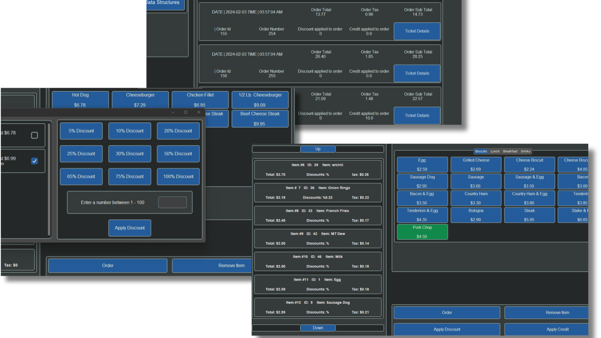

<!-- Improved compatibility of back to top link: See: https://github.com/othneildrew/Best-README-Template/pull/73 -->
<a name="readme-top"></a>
<!--
*** Thanks for checking out the Silk Serve POS project by JoshHill90.

*** Don't forget to give the project a star if you find it useful!
*** Thank you for your support! Now, let's create something amazing! :D
-->


<!-- PROJECT SHIELDS -->


<!-- PROJECT LOGO -->
<br />
<div align="center">
  <a href="https://github.com/JoshHill90/silk-serve-pos">

  </a>  
  <h3 align="center">Silk Serve POS</h3>
  <p align="center">
    A Python-based Point of Sale (POS) system using Tkinter and SQLite for efficient retail management.
    <br />
  </p>
</div>


<!-- TABLE OF CONTENTS -->
<details>
  <summary>Table of Contents</summary>
  <ol>
    <li>
      <a href="#about-the-project">About The Project</a>
      <ul>
        <li><a href="#built-with">Built With</a></li>
      </ul>
    </li>
    <li>
      <a href="#getting-started">Getting Started</a>
      <ul>
        <li><a href="#installation">Installation</a></li>
      </ul>
    </li>

  </ol>
</details>


<!-- ABOUT THE PROJECT -->
## About The Project

 (https://projects.silkthreaddev.com/silk-serve-pos/)

Silk Serve POS is a Python-based Point of Sale (POS) system developed to streamline retail operations. It leverages Tkinter for the graphical user interface and utilizes SQLite for efficient data storage.

<p align="right">(<a href="#readme-top">back to top</a>)</p>


### Built With

* Python
* Tkinter
* SQLite

<p align="right">(<a href="#readme-top">back to top</a>)</p>


<!-- GETTING STARTED -->
## Getting Started

To get started with Silk Serve POS, follow the steps below:

### Installation

1. **Clone from GitHub:**
   ```sh
   git clone https://github.com/JoshHill90/silk_serve.git
   
2. **Virtual Environment:**
    ```sh
    python -m venv {venv name}

3. **Install Dependencies:**
    ```sh
    pip install -r requirements.txt
   
4. **Start Venv:**
   ```sh
   source {venv name}/bin/activate  # for Unix/Linux
   
- **or**
    ```sh
    {venv name}\Scripts\activate  # for Windows

5. **Run Project:**
    ```sh
    python Silk_Serve.py
<p align="right">(<a href="#readme-top">back to top</a>)</p>
<!-- USAGE -->
Usage
Silk Serve POS provides a user-friendly interface for efficient retail management. Explore the features to handle items, orders, and sales data seamlessly.

<p align="right">(<a href="#readme-top">back to top</a>)</p>
<!-- CURRENT FEATURES -->
Current Features
Import retail items from CSV for database population.
Add, remove, and discount items within orders.
Apply discounts to orders and single credits.
Cancel and place orders with ease.
Access sales data through the companion application, Silk Flow.
<p align="right">(<a href="#readme-top">back to top</a>)</p>
<!-- CONTRIBUTING -->
Contributing
Contributions are currently not accepted for this project. Feel free to clone this a starting point and do what you wish.

<p align="right">(<a href="#readme-top">back to top</a>)</p>
<!-- CONTACT -->
Contact
Joshua Hill - @JoshHill90 - josh@silkthreaddev.com

Project Link: https://github.com/JoshHill90/silk_serve

<p align="right">(<a href="#readme-top">back to top</a>)</p>